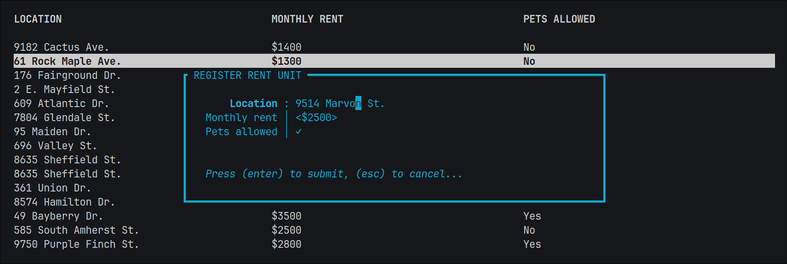

# 🏔️ Tundra

Tundra provides a framework and utilities for creating interactive terminal applications with Ratatui. 

Ratatui is a comprehensive library for creating singular user interfaces in the terminal, but lacks features
for organizing larger applications — composed of several interfaces — and for receiving user data input. 

Tundra aims to extend the functionality of Ratatui with utilities for: 

- Defining application states. 
- Managing the terminal environment and context. 
- Displaying messages through modal dialogs. 
- Receiving user input through input forms and fields. 

Tundra is also highly extensible with tools to easily define your own dialogs and input fields. 

It is **not** intended to be a replacement for or wrapper over Ratatui, nor the backend. Ratatui is still
required to draw the user interface of each application state, and the backend is still required for
low-level terminal operations. 

## 📚 Documentation

Read the documentation **[HERE](https://docs.rs/tundra/latest/tundra/)**. 

## 🪪 Modal Dialogs

Modal dialogs are small pop-up "windows" displayed atop a background application state. They contain messages
or prompt for user input and are shown simply by calling a function. Here is an example of an error message
shown in a dialog: 

Tundra defines several more such dialogs with easy-to-use interfaces, and provides utilities for creating
custom dialogs. 

## 🕹️ User Input

User input is facilitated through a macro that displays a form with specified fields inside a dialog. The 
return value of the macro invocation is a struct containing the values entered by the user for each field.
Both the values and the fields are stored as members of unspellable structs created inside the macro — no
runtime lookup is required! Here is an example of such a form: 

Tundra defines several types of fields for entering common types of data, and provides utilities for 
creating custom fields. 

## 🪧 A Note on the Backend
 
Ratatui has support for several terminal backends. If you don't know what that means, this note holds no
significance for you. 
 
Tundra currently only supports the crossterm backend. This is due to a lack of abstraction over the different
backends. Code — particularly pertaining to context and event handling — would have to be written and
repeated for each backend. 
 
If you need another backend for your project, Tundra is not for you — at least for the moment. 
